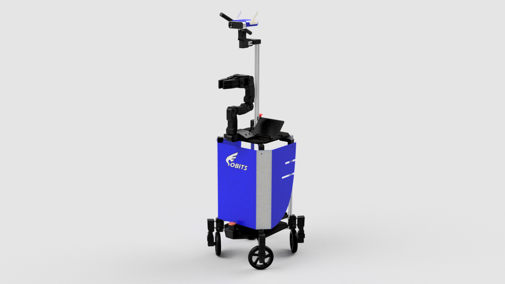

# ROS Package for SOBIT_PRO

SOBIT_PROの制御を行うリポジトリ．

## SOBIT_PRO


## Prerequisites
以下の環境で動作します．
- OS: Ubuntu 18.04 
- ROS distribution: melodic Kame

### How to use
以下のコマンドを入力することで，SOBIT_PROを起動することができます．
これにより，SOBIT_PROのモータやRGB-Dカメラ，測域センサ(Lidar)などのデバイスが起動します．
また，それと同時にRvizも起動します．

```bash:
$ roslaunch sobit_pro_bringup minimal.launch
```
