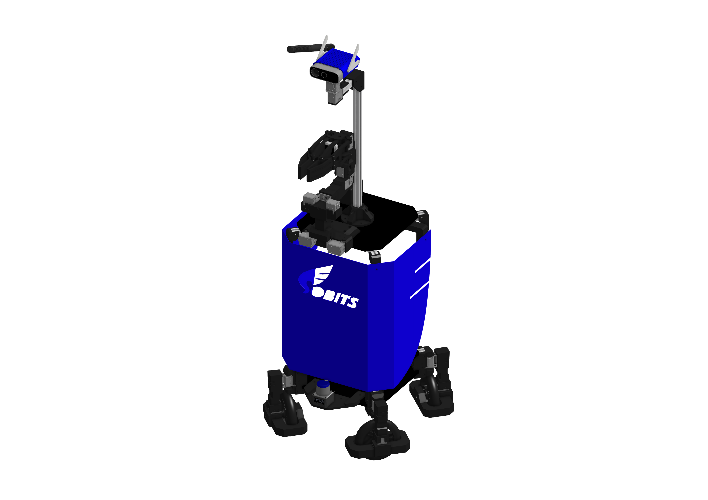
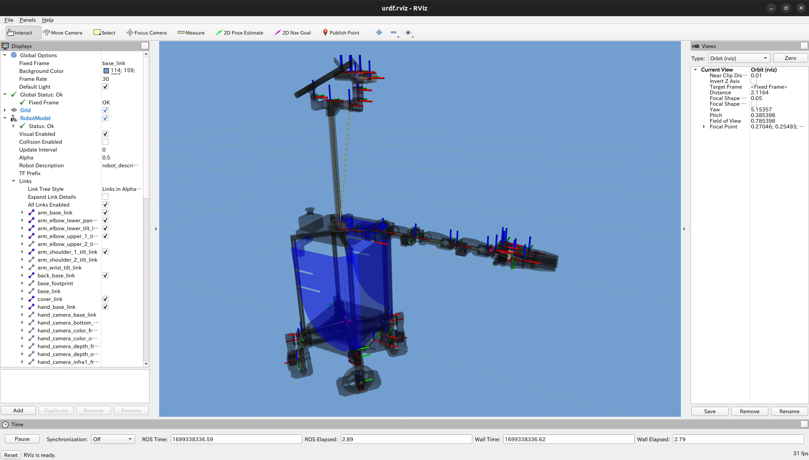
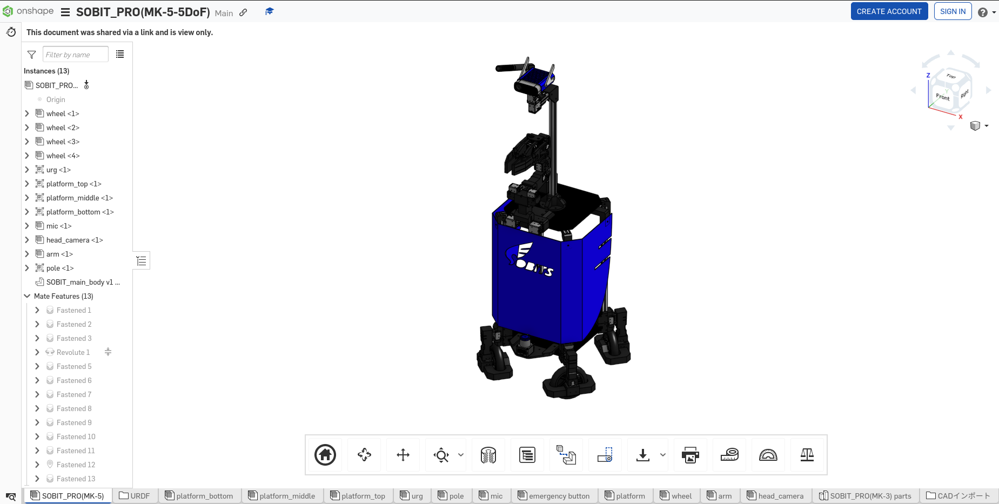

<a name="readme-top"></a>

[JA](README.md) | [EN](README.en.md)

[![Contributors][contributors-shield]][contributors-url]
[![Forks][forks-shield]][forks-url]
[![Stargazers][stars-shield]][stars-url]
[![Issues][issues-shield]][issues-url]
[![License][license-shield]][license-url]

# SOBIT PRO

<!-- 目次 -->
<details>
  <summary>目次</summary>
  <ol>
    <li>
      <a href="#概要">概要</a>
    </li>
    <li>
      <a href="#セットアップ">セットアップ</a>
      <ul>
        <li><a href="#環境条件">環境条件</a></li>
        <li><a href="#インストール方法">インストール方法</a></li>
      </ul>
    </li>
    <li>
    　<a href="#実行操作方法">実行・操作方法</a>
      <ul>
        <li><a href="#シミュレータの実行方法"> シミュレータの実行方法</a></li>
        <li><a href="#移動機構のみを使用する場合">移動機構のみを使用する場合</a></li>
        <li><a href="#カメラのみを使用する場合">カメラのみを使用する場合</a></li>
        <li><a href="#rviz上の可視化">Rviz上の可視化</a></li>
      </ul>
    </li>
    <li>
    　<a href="#ソフトウェア">ソフトウェア</a>
      <ul>
        <li><a href="#ジョイントコントローラ">ジョイントコントローラ</a></li>
        <li><a href="#ホイールコントローラ">ホイールコントローラ</a></li>
      </ul>
    </li>
    <li>
    　<a href="#ハードウェア">ハードウェア</a>
      <ul>
        <li><a href="#パーツのダウンロード方法">パーツのダウンロード方法</a></li>
        <li><a href="#電子回路図">電子回路図</a></li>
        <li><a href="#ロボットの組み立て">ロボットの組み立て</a></li>
        <li><a href="#ロボットの特徴">ロボットの特徴</a></li>
        <li><a href="#部品リストbom">部品リスト（BOM）</a></li>
      </ul>
    </li>
    <li><a href="#マイルストーン">マイルストーン</a></li>
    <!-- <li><a href="#contributing">Contributing</a></li> -->
    <!-- <li><a href="#license">License</a></li> -->
    <li><a href="#参考文献">参考文献</a></li>
  </ol>
</details>


<!-- レポジトリの概要 -->
## 概要



SOBITSが開発した4輪独立ステアリング駆動式のモバイルマニピュレータ（SOBIT PRO）を動かすためのライブラリである．

> [!WARNING]
> 初心者の場合，実機のロボットを扱う際に，先輩方に付き添ってもらいながらロボットを動かしましょう．

<p align="right">(<a href="#readme-top">上に戻る</a>)</p>


<!-- セットアップ -->
## セットアップ

ここで，本レポジトリのセットアップ方法について説明する．

<p align="right">(<a href="#readme-top">上に戻る</a>)</p>


### 環境条件

まず，以下の環境を整えてから，次のインストール段階に進んでください．

| System  | Version |
| ------------- | ------------- |
| Ubuntu | 24.04 (Noble Numbat) |
| ROS | Jazzy Jalisco |
| Python | 3.12 |


<p align="right">(<a href="#readme-top">上に戻る</a>)</p>


### インストール方法

1. ROSの`src`フォルダに移動する．
   ```sh
    cd ~/colcon_ws/src/
   ```
2. 本レポジトリをcloneする．
   ```sh
    git clone -b jazzy-devel https://github.com/TeamSOBITS/sobit_pro
   ```
3. レポジトリの中へ移動する．
   ```sh
    cd sobit_pro/
   ```
4. 依存パッケージをインストールする．
   ```sh
    bash install.sh
   ```
5. パッケージをコンパイルする．
   ```sh
    cd ~/colcon_ws/
    colcon build --symlink-install
    source ~/colcon_ws/install/setup.sh
   ```

<p align="right">(<a href="#readme-top">上に戻る</a>)</p>


<!-- 実行・操作方法 -->
## 実行・操作方法

実機のロボットを起動する場合は[minimal.launch.py](sobit_pro_bringup/launch/real_minimal.launch.py)を実行する。
```sh
ros2 launch sobit_pro_bringup real_minimal.launch.py
```
<p align="right">(<a href="#readme-top">上に戻る</a>)</p>

### シミュレータの実行方法
Gazebo Harmonic環境で[gz_minimal.launch.py](sobit_pro_bringup/launch/gz_minimal.launch.py)を実行する．
```sh
ros2 launch sobit_pro_bringup gz_minimal.launch.py
```

<p align="right">(<a href="#readme-top">上に戻る</a>)</p>


### 移動機構のみを使用する場合

SOBIT PROの移動機構単体で動かすことができる．

1. [real_minimal.launch](sobit_pro_bringup/launch/real_minimal.launch.py)または[gz_minimal.launch](sobit_pro_bringup/launch/gz_minimal.launch.py)の設定を次にように書き換える．
    ```xml
    <!-- Activate Mobile-Base (True), Arm (True), Head (True) -->
    <arg name="enable_mb"           default="True"/>
    <arg name="enable_arm"          default="False"/>
    <arg name="enable_head"         default="False"/>

    <!-- URG: lan-cable (True), usb-cable (False) -->
    <arg name="urg_lan"             default="False"/>
    ```
    
2. 実機の場合は[real_minimal.launch](sobit_pro_bringup/launch/real_minimal.launch.py)シミュレーターの場合は[gz_minimal.launch](sobit_pro_bringup/launch/gz_minimal.launch.py)を実行する．
    ```sh
    ros2 launch sobit_pro_bringup real_minimal.launch.py
    ```

> [!NOTE]
> `use_serial_urg`はLAN式通信の場合は`True`に，USB式通信の場合は`False`に設定してください．

<p align="right">(<a href="#readme-top">上に戻る</a>)</p>

### カメラのみを使用する場合

SOBIT PROに取り付けられたカメラ単体で動かすことができる.xtionの場合は以下のとおりである。
```sh
ros2 launch sobit_pro_bringup xtion.launch.py
```

<p align="right">(<a href="#readme-top">上に戻る</a>)</p>

### Rviz上の可視化

実機を動かす前段階として，Rviz上でSOBIT PROを可視化し，ロボットの構成を表示できる．

```sh
ros2 launch sobit_pro_description display.launch
```

正常に動作した場合は，次のようにRvizが表示される．


<p align="right">(<a href="#readme-top">上に戻る</a>)</p>


## ソフトウェア

<details>
<summary>SOBIT PROと関わるソフトの情報まとめ</summary>


### ジョイントコントローラ

SOBIT PROのパンチルト機構とマニピュレータを動かすための情報である．

#### 動作関数

1.  `move_to_pose()` : [pose_list](sobit_pro_library/config/pose_list.yaml)に決められたポーズに動かせる．
    ```cpp
    # MoveToPose.action
    # Goal
    string pose_name                                # Predefined pose name
    builtin_interfaces/Duration time_allowance      # Limmit time
    ---
    # Result
    bool success                                    # SUCCESS/FAILED
    string message                                  # Result message
    builtin_interfaces/Duration total_elapsed_time  # the time required
    ---
    # Feedback
    string[] current_joint_names                    # Current list of active joint names
    float32[] current_joint_rad                     # Current list of active joint angles
    # float32[] current_joint_vel                     # Current list of active joint angle vellocity
    builtin_interfaces/Duration move_time           # Time taken to date
    ```

> [!NOTE]
> 既存のポーズは[pose_list.yaml](sobit_pro_library/config/pose_list.yaml)に確認できます．ポーズの作成方法については[ポーズの設定方法](#ポーズの設定方法)をご参照ください．

2.  `move_joint` : 指定されたジョイント(複数でも可)を任意の角度に動かします．
    ```cpp
    # MoveJoint.action
    # Goal
    string[] target_joint_names                     # List of joint names to move
    float64[] target_joint_rad                      # List of joint angles to move
    builtin_interfaces/Duration time_allowance      # Limmit time
    ---
    # Result
    bool success                                    # SUCCESS/FAILED
    string message                                  # Result message
    builtin_interfaces/Duration total_elapsed_time  # the time required
    ---
    # Feedback
    string[] current_joint_names                    # Current list of active joint names
    float32[] current_joint_rad                     # Current list of active joint angles
    # float32[] current_joint_vel                     # Current list of active joint angle vellocity
    builtin_interfaces/Duration move_time           # Time taken to date
    ```

> [!NOTE]
> `ジョイント名`は[ジョイント名](#ジョイント名)をご確認ください．

<p align="right">(<a href="#readme-top">上に戻る</a>)</p>


#### ジョイント名

SOBIT PROのジョイント名は以下の通りです．
- arm_shoulder_1_tilt_joint
- arm_elbow_upper_1_tilt_joint
- arm_elbow_lower_tilt_joint
- arm_elbow_lower_pan_joint
- arm_wrist_tilt_joint
- hand_inner_l_joint
- hand_finger_l_joint
- hand_joint
- hand_finger_r_joint
- hand_outer_l_joint
- hand_outer_r_joint
- arm_elbow_upper_2_tilt_joint
- arm_shoulder_2_tilt_joint
- head_pan_joint
- head_tilt_joint
- wheel_b_l_steer_joint
- wheel_b_l_drive_joint
- wheel_b_r_steer_joint
- wheel_b_r_drive_joint
- wheel_f_l_steer_joint
- wheel_f_l_drive_joint
- wheel_f_r_steer_joint
- wheel_f_r_drive_joint


<p align="right">(<a href="#readme-top">上に戻る</a>)</p>


#### ポーズの設定方法

[pose_list.yaml](sobit_pro_library/config/pose_list.yaml)というファイルでポーズの追加・編集ができる．以下のようなフォーマットである．

```yaml
ros_parameters:
    poses:
     - pose_name

    pose_name:
      arm_shoulder_1_tilt_joint     : 1.57
      arm_elbow_upper_1_tilt_joint  : 1.57
      arm_elbow_lower_tilt_joint    : -1.57
      arm_elbow_lower_pan_joint     : 0.00
      arm_wrist_tilt_joint          : -1.57
      hand_joint                    : 0.00
      head_pan_joint                : 0.00
      head_tilt_joint               : 0.00
```  
定義したいポーズ名を`poses`に追加し，その後ポーズ名の下に各ジョイントの角度を設定する．

### ホイールコントローラ

SOBIT PROの移動機構を動かすための情報まとめである．

<p align="right">(<a href="#readme-top">上に戻る</a>)</p>


#### 動作関数

1.  `move_wheel_linear` : 並進（前進・後退・左右並進のみ）に移動させる．(弧度法:meters)
    ```cpp
    # MoveWheelLinear.action
    # Goal
    geometry_msgs/Point target_point                # Distance to be moved （ differential-wheel:x,  omni-direction:(x,y) ）
    builtin_interfaces/Duration time_allowance      # Limmit time
    ---
    # Result
    bool success                                    # SUCCESS/FAILED
    string message                                  # Result message
    builtin_interfaces/Duration total_elapsed_time  # the time required
    ---
    # Feedback
    geometry_msgs/Point current_point               # Distance traveled to date
    builtin_interfaces/Duration move_time           # Time taken to date
    ```  
2.  `move_wheel_rotate` : 回転運動を行う．(弧度法：Radian)
    ```cpp
    # MoveWheelRotate.action
    # Goal
    float32 target_yaw                              # Angle to be rotated
    builtin_interfaces/Duration time_allowance      # Limmit time
    ---
    # Result
    bool success                                    # SUCCESS/FAILED
    string message                                  # Result message
    builtin_interfaces/Duration total_elapsed_time  # the time required
    ---
    # Feedback
    float32 current_yaw                             # Angle rotated to date
    builtin_interfaces/Duration move_time           # Time taken to date
    ```

</details>

<p align="right">(<a href="#readme-top">上に戻る</a>)</p>


## ハードウェア
SOBIT PROはオープンソースハードウェアとして[OnShape](https://cad.onshape.com/documents/4acbecde07fba120a62ec033/w/c6217b66947274dee4e8f911/e/c2e5c16292d7dfc11ee3cc01)にて公開している．



<p align="right">(<a href="#readme-top">上に戻る</a>)</p>


<details>
<summary>ハードウェアの詳細についてはこちらを確認してください．</summary>

### パーツのダウンロード方法

1. Onshapeにアクセスしましょう．

> [!NOTE]
> ファイルをダウンロードするために，`OnShape`のアカウントを作成する必要はありません．ただし，本ドキュメント全体をコピーする場合，アカウントの作成を推薦します．

2. `Instances`の中にパーツを右クリックで選択します．
3. 一覧が表示され，`Export`ボタンを押してください．
4. 表示されたウィンドウの中に，`Format`という項目があります．`STEP`を選択してください．
5. 最後に，青色の`Export`ボタンを押してダウンロードが開始されます．

<p align="right">(<a href="#readme-top">上に戻る</a>)</p>


### 電子回路図

TBD

<p align="right">(<a href="#readme-top">上に戻る</a>)</p>


### ロボットの組み立て

TBD

<p align="right">(<a href="#readme-top">上に戻る</a>)</p>


### ロボットの特徴

| 項目 | 詳細 |
| --- | --- |
| 最大直進速度 | 0.7[m/s] |
| 最大回転速度 | 0.229[rad/s] |
| 最大ペイロード | 0.35[kg] |
| サイズ (長さx幅x高さ) | 450x450x1250[mm] |
| 重量 | 16[kg] |
| リモートコントローラ | PS3/PS4 |
| LiDAR | UST-20LX |
| RGB-D | Azure Kinect DK (頭部)，RealSense D405 (アーム) |
| IMU | LSM6DSMUS |
| スピーカー | モノラルスピーカー |
| マイク | コンデンサーマイク |
| アクチュエータ (アーム) | 2 x XM540-W150, 6 x XM430-W320 |
| アクチュエータ (移動機構) | 4 x XM430-W320, 4 x XM430-W210 |
| 電源 | 2 x Makita 6.0Ah 18V |
| PC接続 | USB |

<p align="right">(<a href="#readme-top">上に戻る</a>)</p>


### 部品リスト（BOM）

| 部品 | 型番 | 個数 | 購入先 |
| --- | --- | --- | --- |
| --- | --- | 1 | [link]() |
| --- | --- | 1 | [link]() |
| --- | --- | 1 | [link]() |
| --- | --- | 1 | [link]() |
| --- | --- | 1 | [link]() |
| --- | --- | 1 | [link]() |
| --- | --- | 1 | [link]() |
| --- | --- | 1 | [link]() |
| --- | --- | 1 | [link]() |
| --- | --- | 1 | [link]() |
| --- | --- | 1 | [link]() |
| --- | --- | 1 | [link]() |
| --- | --- | 1 | [link]() |


</details>

<p align="right">(<a href="#readme-top">上に戻る</a>)</p>


<!-- マイルストーン -->
## マイルストーン

- [ ] 電子回路図の追加
- [ ] ロボットの組み立て方の追加
- [ ] 部品リストのlink先の追加

現時点のバッグや新規機能の依頼を確認するために[Issueページ][issues-url] をご覧ください．

<p align="right">(<a href="#readme-top">上に戻る</a>)</p>


<!-- CONTRIBUTING -->
<!-- ## Contributing

Contributions are what make the open source community such an amazing place to learn, inspire, and create. Any contributions you make are **greatly appreciated**.

If you have a suggestion that would make this better, please fork the repo and create a pull request. You can also simply open an issue with the tag "enhancement".
Don't forget to give the project a star! Thanks again!

1. Fork the Project
2. Create your Feature Branch (`git checkout -b feature/AmazingFeature`)
3. Commit your Changes (`git commit -m 'Add some AmazingFeature'`)
4. Push to the Branch (`git push origin feature/AmazingFeature`)
5. Open a Pull Request

<p align="right">(<a href="#readme-top">上に戻る</a>)</p> -->


<!-- LICENSE -->
<!-- ## License

Distributed under the MIT License. See `LICENSE.txt` for more NOTErmation.

<p align="right">(<a href="#readme-top">上に戻る</a>)</p> -->


<!-- 参考文献 -->
## 参考文献

* [Dynamixel SDK](https://emanual.robotis.com/docs/en/software/dynamixel/dynamixel_sdk/overview/)
* [ROS Jazzy](https://docs.ros.org/en/jazzy/index.html#)
* [ROS Control](http://wiki.ros.org/ros_control)

<p align="right">(<a href="#readme-top">上に戻る</a>)</p>


<!-- MARKDOWN LINKS & IMAGES -->
<!-- https://www.markdownguide.org/basic-syntax/#reference-style-links -->
[contributors-shield]: https://img.shields.io/github/contributors/TeamSOBITS/sobit_pro.svg?style=for-the-badge
[contributors-url]: https://github.com/TeamSOBITS/sobit_pro/graphs/contributors
[forks-shield]: https://img.shields.io/github/forks/TeamSOBITS/sobit_pro.svg?style=for-the-badge
[forks-url]: https://github.com/TeamSOBITS/sobit_pro/network/members
[stars-shield]: https://img.shields.io/github/stars/TeamSOBITS/sobit_pro.svg?style=for-the-badge
[stars-url]: https://github.com/TeamSOBITS/sobit_pro/stargazers
[issues-shield]: https://img.shields.io/github/issues/TeamSOBITS/sobit_pro.svg?style=for-the-badge
[issues-url]: https://github.com/TeamSOBITS/sobit_pro/issues
[license-shield]: https://img.shields.io/github/license/TeamSOBITS/sobit_pro.svg?style=for-the-badge
[license-url]: LICENSE
